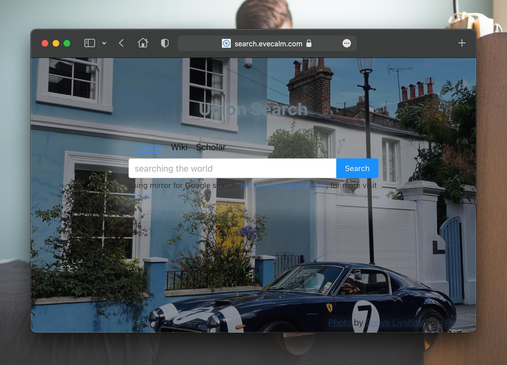
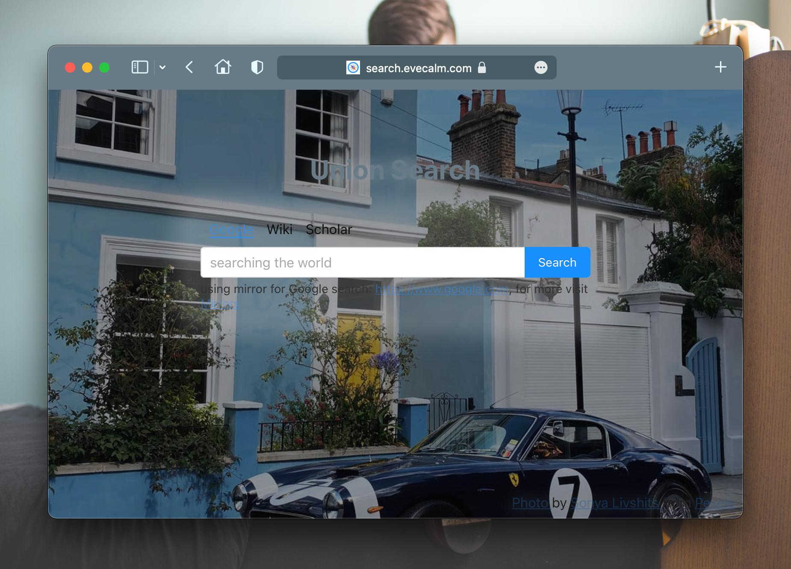
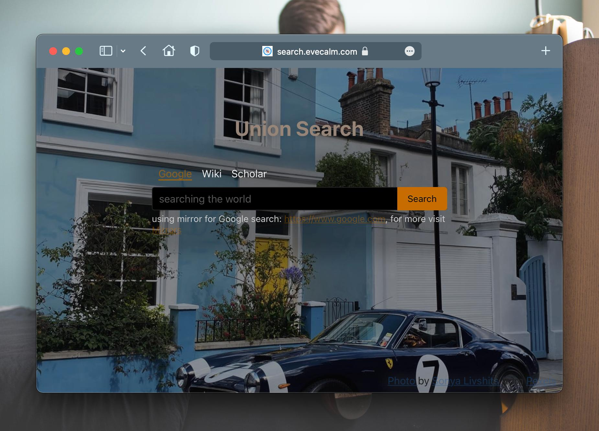

近期对 [综合搜索](https://search.evecalm.com/) 网站改版后(简化了版面、增加了动态背景图), 又做了两处和颜色相关的优化.

## 主题色 Theme-color
最新的 Safari 15 已经支持了 [Theme-color](https://developer.mozilla.org/en-US/docs/Web/HTML/Element/meta/name/theme-color) 特性, 可以用于设置浏览器顶部的地址栏颜色, 使地址栏和网站看起来浑然一体. 于是我又开始折腾起来.

[综合搜索](https://search.evecalm.com/) 已经使用了 [Pexels](https://www.pexels.com/api/) 提供的免费API来获取背景图片, 并且会定时更新, 我希望主题色能根据背景图而变, 使用背景图的主色调作为主题色, 这样看起来整个效果更加协调. 于是我使用了之前的文章 [如何获取图片上某个像素点的颜色值](https://blog.evecalm.com/2020/06/get-color-from-image.html) 中提到的获取图片平均颜色的方法, 将主题色设置为背景图的平均颜色. 下边是添加主题色前后的效果对比.

计算图片的平均颜色, 需使用 [canvas 技术](http://developer.mozilla.org/en-US/docs/Web/HTML/Element/canvas), 这里面需要注意两点:
1. 如果图片跨域, 图片需要支持跨域访问: 一般图片不论是否跨域都能使用 `img` 标签加载, 但是并不一定支持跨域(需要图片请求的响应头包含 `Access-Control-Allow-Origin` 和 `Access-Control-Allow-Methods` 等头), 可访问 [enable-cors](https://enable-cors.org/) 获取相关信息. 幸好 Pexels 支持跨域了
2. canvas 加载的图片的 `img` 元素需要设置 `crossOrigin` 属性: 一般设置为空字符串即可, 详情可访问 [img#attr-crossorigin](https://developer.mozilla.org/en-US/docs/Web/HTML/Element/img#attr-crossorigin), 如果通过 js 创建 img 标签来加载图片, 则该属性必须在设置图片 `src` 之前

## 网站文字颜色
因为网站背景色会不断变化, 就很容易出现网站中心内容的文字在浅色背景下难以辨认的问题, 虽然给内容区域添加了半透明背景, 但情况依旧没有改善. 于是乎, 我想到将文字颜色设置成主题色的反转色, 以此来增强文字的辨识度, 提升可读性. 这里我使用了一个css 的 `filter` 属性:
  > `filter: invert(100%)`, 详细可 [参考mdn](http://developer.mozilla.org/en-US/docs/Web/CSS/filter-function/invert())

最终的效果的确令人满意, 但并非我一开始期望的主题色的反转色, 而是将文字原本的蓝色主色调反转成了某全球知名视频网站的主色调: 金黄色. 阴差阳错的发现, 这种黄色在各种背景图下辨识度都非常好. 虽然这个颜色看来有点不太舒服, 还是将错就错吧, 懒得改了. 下面是最终的效果图.

相关链接:
1. <https://search.evecalm.com/>, 可使用 Safari 15 或者 最新的安卓原生浏览器 访问以体验效果
2. [theme-color.ts](https://github.com/oe/search/blob/e54e50ee18/src/background/theme-color.ts), 核心代码实现

