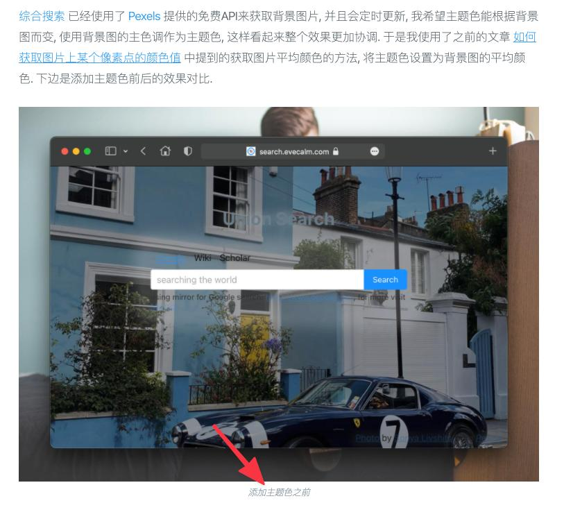

去年五月我写了一篇博客 [博客重启更新](/2020/05/restart-to-blog.html), 写完没多久, 工作就开始忙起来, 累成狗. 然后再没过多久, 我又换了一份工作(换工作部分原因也是因为原来工作太累), 来到了一个大厂. 万万没想到的是, 大厂更累, 博客也就再次停更, 一年后的现在身体才慢慢适应过来.

现在, 我将再次启用博客, 不定期更新内容, 记录自己的日常及学习心得, 锻炼自己的书写能力, 也磨砺自己的思维. 文章将依旧以短文为主, 降低读者阅读时间(毕竟在这个年代, 大家的时间都过于宝贵, 精力也越难以长时间集中), 也减少我写作一篇文章的耗时.

重启的同时, 我也对本博客进行了优化, 将博客页面核心内容加载大小从原来的几百Kb降低到了不到100Kb. 

博客是基于[hexo](https://hexo.io/)构建的静态博客, 使用了[tranquilpeak](https://github.com/LouisBarranqueiro/hexo-theme-tranquilpeak/)主题, 托管在 Github Pages, 同时还使用了 cloudflare 的免费cdn. 以下是几个优化点, 仅供参考:
1. 优化博客引用本地图片文件的方式, 使用了hexo插件[hexo-intuitive-image](https://github.com/oe/hexo-intuitive-image). 该插件由我编写, hexo 自带的 [Asset Folders](https://hexo.io/docs/asset-folders) 功能过于局限, 不灵活, 引用图片方式也太符合直觉. 在网上搜索、折腾了好久, 没有达到我的期望, 在阅读了hexo源码后, 我才自己写了这么个插件. 该插件还支持让发布后的博客文章从 cdn <jsdelivr.com> 来加载博客图片.
2. 为图片增加文字标题, 主题 tranquilpeak 构建出的文章并不会显示图片的标题, 对读者不太友好, 这里就在前端js中做了下[手动处理](https://github.com/oe/blog.evecalm.com/blob/65d6d65f4c/themes/tranquilpeak/source/_js/fancybox.js#L35-L49). 效果如下:
   
3. 优化了图片素材的大小, 这里使用了谷歌开发的在线工具[squoosh](https://squoosh.app/)来压缩图片. 使用时发现 `avif` 格式的图片压缩效果惊人, 可以将图片压缩至原图大小的 10% 以内, 图片效果并没有明显变化, 而且比较新的浏览器[均已支持](https://caniuse.com/?search=avif). 于是我将网站背景图额外压缩了 `avif`、`webp`(压缩率次之)两种格式的图片
4. 压缩hexo生成出的 html 页面, 这里使用了插件 [hexo-html-minifier](https://github.com/hexojs/hexo-html-minifier)
5. 移除不必要的js, 部分公共库从外部cdn加载

博客仓库地址为 <https://github.com/oe/blog.evecalm.com>, 感兴趣的可以前往观摩.
