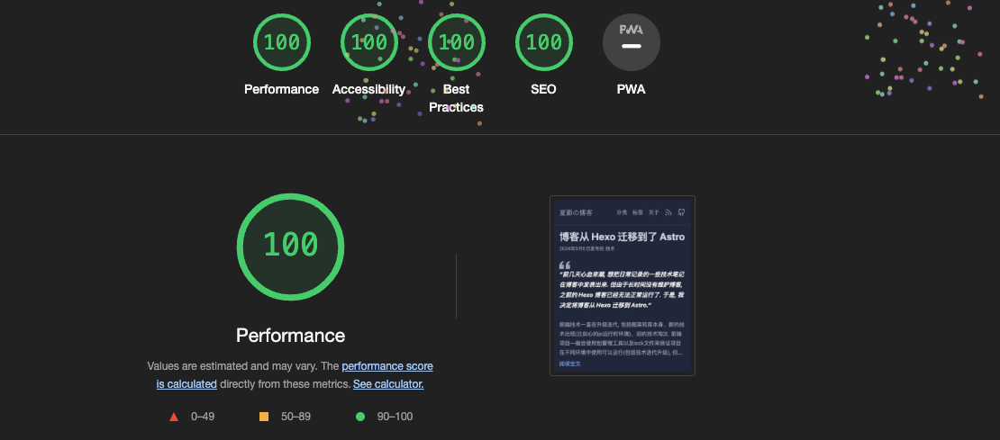

> 前几天心血来潮, 想把日常记录的一些技术笔记在博客中发表出来. 但由于长时间没有维护博客, 之前的 Hexo 博客已经无法正常运行了. 于是, 我决定将博客从 Hexo 迁移到 Astro.

前端技术一直在升级迭代, 包括框架和库本身、新的技术出现(比如心的js运行时环境)、旧的技术淘汰. 前端项目一般会使用包管理工具以及lock文件来保证项目在不同环境中使用可以运行(包括技术迭代升级), 但也有失效的时候, 比如我博客原来使用的 [Hexo](https://hexo.io/zh-cn/). 虽然 Hexo 本身依旧在迭代升级中, 我也不太想去纠结其无法运行的原因了, 我选择了将博客从 Hexo 迁移到 [Astro](https://astro.build/), 一款新的静态网站生成器, 个人最近的项目也都在使用它.

Astro 功能很强大, 它是一个类似 Next.js 的框架, 但更轻量、更灵活, 对内容型(md, mdx)网站支持很好, 支持island架构, 默认使用 SSG, 也可以使用 SSR, 前端框架无关, 可以使用 React, Vue, Svelte 等. 生成的静态网站性能比 Next.js 要高很多.

以下是博客从 Hexo 迁移到 Astro 前后的效果的简单对比.

| 框架 | Hexo | Astro |
|:---:|:---:|:---:|
| 单页面文件大小 | ~100kb  | <= 12kb |
| Lighthouse 打分 | ~90  | 100 |

> 注意: 以上分数是在本地构建后, 在浏览器隐身模式中测试所得. lighthouse 评分会受到很多因素影响, 比如网络环境、浏览器是否安装插件等, 但可以作为一个参考.

以下是博客从 Hexo 迁移到 Astro 的简易说明, 博客采用 react + tailwindcss 来开发部分UI, 这里只是简单的说明, 具体细节可以参考官方文档 [Astro](https://astro.build/) 及 [博客源码](https://github.com/oe/blog.evecalm.com).
1. 将 Hexo 博客中的 md 文件复制到 `src/content/blog`· 目录下, 并在 `src/content/config.ts` 中定义博客的 frontmatter 结构
2. 在 `src/pages` 增加博客各个页面的路由及页面, 使用 `[...slug].astro` 来定义动态路由
3. 在 `src/layouts` 中增加博客页面的模板布局, 部分组件使用 react 开发, 放置在 `src/components` 目录下

博客虽然使用了 react, 但是最终构建出来的静态博客并没有任何 react 相关代码, 因为所有的react 组件都可以静态化.

博客本身在原来基础上还做了些小优化
1. 博文使用的 Disqus 评论系统会在博客滚到评论区域时才加载, [参见 post-comment.astro](https://github.com/oe/blog.evecalm.com/blob/main/src/components/post-comment.astro)
2. 博客的标签和分类搜索对中文搜索进行了优化, 输入法输入完毕才进行搜索 [参见 tag-home.astro](https://github.com/oe/blog.evecalm.com/blob/main/src/layouts/tag-home.astro)
3. 给[博客的rss地址](/atom.xml)增加的样式文件, [参见 atom.xml.ts](https://github.com/oe/blog.evecalm.com/blob/main/src/pages/atom.xml.ts) (这里有个小缺陷, 因 astro 的限制, 在rss中输出的内容是未编译的markdown, 导致rss内容无法正常展示文章的图片, 故rss只截取了部分内容)
4. 优化了博客的 SEO, 在页面 HTML中增加了 property:og 相关的 meta 信息, [参见 base.astro](https://github.com/oe/blog.evecalm.com/blob/main/src/layouts/base.astro), 博文的 frontmatter 中增加了 description 字段 用于 SEO 描述.

